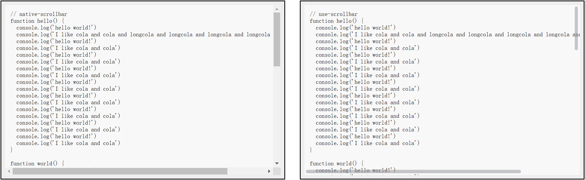
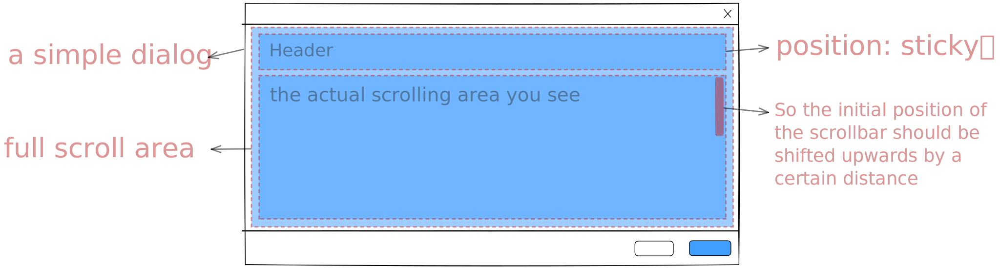

<p align="center">
  
</p>

<p align="center">
  <!-- npm version -->
  <a href="https://github.com/Lionad-Morotar/use-scrollbar"></a>
  <!-- ci status -->
  <a href="https://github.com/Lionad-Morotar/use-scrollbar/actions/workflows/ci.yml"></a>
  <!-- license -->
  <a href="https://github.com/Lionad-Morotar/use-scrollbar/blob/main/LICENSE"></a>
</p>

<div align="center">

# use-scrollbar

`use-scrollbar` enables a component based on a native scrollbar to replace its native scrollbar with a virtual scrollbar, NOT virtual scroll.

</div>

## 🎇 Brief

Assuming a 400px height div, you can easily get a div with beautiful virtual scrollbars by simply wrap the div with [ElementPlus Scrollbar](https://element-plus.gitee.io/zh-CN/component/scrollbar.html) scrollbars. But  none of the popular scrollbar components provide an interface for handling complex elements, that is to say, you cant wrap an complex component with [ElementPlus Scrollbar](https://element-plus.gitee.io/zh-CN/component/scrollbar.html) to have its internal native scrollbar replaced with beautiful virtual scrollbars. So you need `use-scrollbar`.

## ⚒️ Feature

- [x] **Powerful API**, have ability to deal with complex components[^1], such as vxe-table
- [x] **Customisable**, so that you can create your own scrollbar style, animation and user interaction
- [x] **Theme**, integrated with these style configurations: ElementPlus, Steam, CSS-Tricks ...
- [x] **Full Typed**, with the power of typescript
- [ ] WIP <del>Support Vue2 & Vue3</del>
- [ ] WIP <del>Vue Directives</del>
- [ ] WIP <del>Headless Component</del>
- [ ] WIP <del>Github pages for document and preview</del>

[^1]: which is not possible with other libraries

and PRs are welcom

## 📸 Preview

<h4>1. Native Scrollbar <strong>VS</strong> Custom Scrollbar (theme: default)</h4>

<p align="center">
  
</p>

<h4>2. Native Scrollbar <strong>VS</strong> Custom Scrollbar (theme: css-tricks)</h4>

<p align="center">
  
</p>

## 🤹‍♀️ Usage

Simple Example

```typescript
import { onMounted, ref } from 'vue'
import { useSrollbar } from 'use-scrollbars'

const componentOrElementRef = ref(null);
const barStates = useScrollbar(componentOrElementRef, {
  // override default options
});

// dont forget to import style.css
// in your main.ts (or entry.ts anyway)
import "use-scrollbars/dist/style.css"
```

Another Example

```typescript
import { watchEffect, onMounted, ref } from 'vue'
import { useSrollbar } from 'use-scrollbars'

const componentOrElementRef = ref(null);
const barStates = useScrollbar(componentOrElementRef, {
  // override default options
});

const componentStates = ref('your-states');
watchEffect(() => {
  if (componentStates.valu3 === 'your-states') {
    barStates.theme = 'steam'
  } else {
    barStates.destroy()
  }
})
```

## 📦 Install

```bash
pnpm install use-scrollbars
```

## 🗂️ Document

### 1. States

#### 1.1. barStates.theme

改变滚动条样式。

```typescript
const theme = 'normal' // 'normal' | 'steam' | 'css-tricks'
barStates.theme = theme
```

#### 1.2. barStates.offset

改变滚动条相对挂载元素的偏移量。

```typescript
barStates.offset.y.top = 10 // px
barStates.offset.y.right = 10 // px
barStates.offset.x.left = 5 // px
barStates.offset.x.bottom = 5 // px
```

#### 1.3. barStates.scrollTop

如果传入多个 wrapper，那么 scrollTop 属性等同于这几个 wrapper 对应 DOM 元素的最大的哪个 scrollTop 属性。如果需要滚动 wrapper 中的内容，可以给 scrollTop 设置值，也可以使用 [barStates.scrollTo](#barStates-scrollTo) 方法。

#### 1.4. barStates.scrollLeft

类似 [barStates.scrollTop](#barStates-scrollTop)。

#### 1.5. barStates.isDragging

判断当前滚动条是否出于拖动状态。

```typescript
console.log(barStates.isDragging.y)
```

### 2. Actions

#### 2.1. barStates.init

如果不是通过显式初始化（即 `useScrollbar(elem)`）的方式自动初始化滚动条，那么需要使用 init 方法手动初始化。init 方法提供了对控制滚动区（甚至多个滚动区）所需要的更细致的参数。

```typescript
const $parent = cmptRef.value.$el.parentElement;
const $wrapper = $parent.querySelector(".content-wrapper");
const $content = $parent.querySelector(".content");

// 详细 API 见类型文档
barStates.init({
  mount: cmptRef.value,
  content: [$content],
  // 可以不传，默认为 content 的 上一级父元素
  wrapper: [$wrapper],
  // 可以不传，默认为 wrapper 或 wrapper 的第一个元素
  viewport: $wrapper,
})
```

#### 2.2. barStates.visibleOnHover

监听传入元素的鼠标事件，mouseenter 时显示滚动条，mouseleave 时隐藏滚动条。

#### 2.3. barStates.setOffset

根据传入元素的尺寸自动设置滚动条的偏移量。在某些场景非常有用，比如你想改变一个弹窗，其滚动区域为整个弹窗内容区域，但是内容区填充了一个 `position:sticky` 头部，此时，如果将滚动条直接挂载到弹窗的内容区域，那么 y 轴滚动条的上方偏移量应为头部的高度。你可以在 barStates.setOffset 中传入此头部元素或组件，动态跟踪其高度并自动设置偏移量。

<p align="center">
  
</p>

```typescript
const cmptOrElemRef = ref(null);

barStates.setOffset({
  y: {
    top: cmptOrElemRef,
  }
})
```

### 3. Hooks

#### 3.1 useScrollbar

等同于 useScrollbars，用于将一个已有的滚动系统的原生滚动条替换为虚拟滚动条，也是这个库最主要的功能。

#### 3.2 useNativeScrollbar

获取原生滚动条相关的一些信息，如宽度。

```typescript
const nativeBar = useNativeScrollbar()

console.log(nativeBar.thick) // usually 17px in Windows
```

## 🚩 Dev

如果在开发环境遇到 `xe-utils` 没有 esm 格式导出的问题，需使用 `./patch/xe-utils-esm` 这个包作为替代：

```bash
# 1. 使用本地依赖安装 xe-utils
pnpm link "link:./patch/xe-utils-esm"
# 2. 然后强制重启本地服务器
vite ./play --force
```

## 📄 License

MIT License
